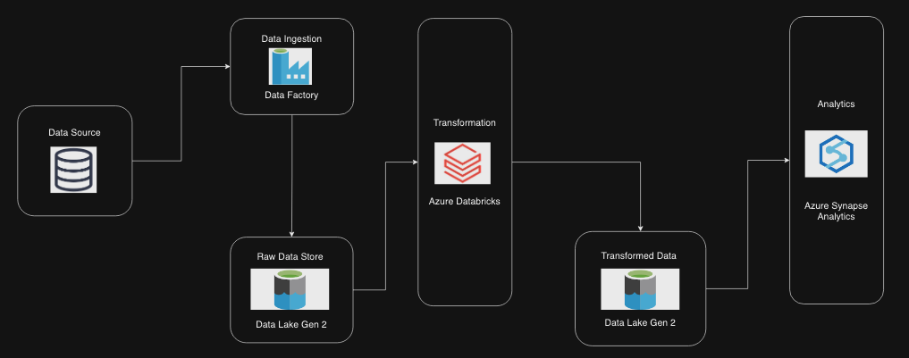

# 2021 Tokyo Olympic Data Analytics | Azure Data Engineering Project

## Introduction
This project dives into the world of Olympics data analytics using modern data engineering practices on Microsoft Azure. We'll leverage different services like Datafactory for building ETL pipelines, Data Lake Gen for storing raw and transformed data, Databricks for transforming data using spark, Synapse Analytics for builing scalable databases and Cloud Storage for managing the data throughout the process.

## Architecture

## Technology Used
1. Programming Language - Python
2. Scripting Language - SQL
3. Microsoft Azure
   - Cloud Storage
   - Data Factory
   - Data Lake Gen2
   - Databricks
   - Synapse Analytics
   - Compute Instance

## Dataset Used
This contains the details of over 11,000 athletes, with 47 disciplines, along with 743 Teams taking part in the 2021(2020) Tokyo Olympics. This dataset contains the details of the Athletes, Coaches, Teams participating as well as the Entries by gender. It contains their names, countries represented, discipline, gender of competitors, name of the coaches.

*updated the dataset with medals(gold, silver, bronze), more details about the athletes.

Here is the dataset link - https://github.com/ratul-07/tokyo-olympic-data-engineering-project-azure/tree/main/Data

Original Kaggle link - https://www.kaggle.com/datasets/arjunprasadsarkhel/2021-olympics-in-tokyo 

Source: Tokyo Olympics 2020 Website

## Data Ingestion Pipeline creation using Data Factory

## Synapse Analytics Database Creation

